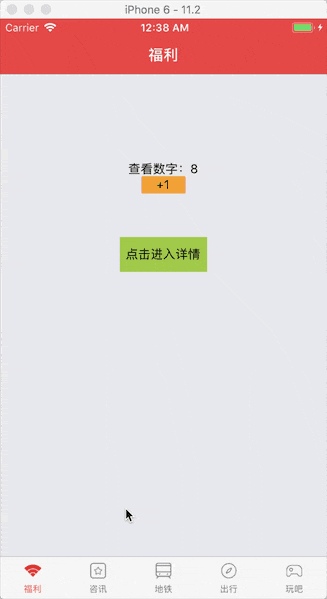

# peanutWIFI 花生地铁
* 使用react native + redux + react navigation
## 5.20 初始化项目
* 此项目为工作业余时间开发，进展会比较慢...

## 5.21 添加顶部navBar导航栏,底部tab栏
* createStackNavigator（老式写法：StackNavigator）
* createBottomTabNavigator（老式写法：TabNavigator）

## 5.23 解决顶部navBar跟底部的tabBar冲突的问题。（要么顶部标题都为空，要么都一样）
* ### 使用的react-navigation版本为2.0.1, react-native版本为0.55.4, react版本为16.3.1
* ### 由于之前的写法：将createStackNavigator所获得的navigator作为最外层； 
```
    const AppNavigator = createStackNavigator(
     {
      Home:{
        screen: Tab,
        navigationOptions:{
          title:"福利"
        }
     },
    {
      initialRouteName: 'Home',
      navigationOptions:{
        headerStyle:{ backgroundColor:'#fb4747'},
        headerTitleStyle: { color: '#fff'},
      }
    }
    
);
    
```
* ### 将createBottomTabNavigator中的五个Tab分别都写成五个对象，其export出去的的navigator放在StackNavigator中，并作为initialRouteName 
```
const Tab = createBottomTabNavigator(
{
    Welfare:{ 
        screen: Welfare,  
        navigationOptions:{ 
            tabBarLabel:'福利',
            tabBarIcon:({focused}) => (  
                <Image 
                    source={{uri: focused ? 'connect_selected' : 'connect_normal'}}  
                    style={{width:20,height:14}}  
                    />  
            ),
        }    
    },
    News:{ 
        screen: News,
        navigationOptions:{
            tabBarLabel:'咨讯',
            tabBarIcon:({focused}) => (  
                <Image 
                    source={{uri: focused ? 'news_selected' : 'news_normal'}}  
                    style={{width:18,height:18}}  
                    />  
            ),
        
        }
    },
    Metro:{ 
        screen: Metro,
        navigationOptions:{
            tabBarLabel:'地铁',
            tabBarIcon:({focused}) => (  
                <Image 
                    source={{uri: focused ? 'travel_selected' : 'travel_normal'}}  
                    style={{width:18,height:18}}  
                    />  
            ),
        }
    },
    Travel:{ 
        screen: Travel,
        navigationOptions:{
            tabBarLabel:'出行',
            tabBarIcon:({focused}) => (  
                <Image 
                    source={{uri: focused ? 'trip_selected' : 'trip_normal'}}  
                    style={{width:18,height:18}}  
                    />  
            ),
        }
    },
    Play:{ 
        screen: Play,
        navigationOptions:{
            tabBarLabel:'玩吧',
            tabBarIcon:({focused}) => (  
                <Image 
                    source={{uri: focused ? 'game_selected' : 'game_normal'}}  
                    style={{width:18,height:14}}  
                    />  
            ),
        }
    }
    },
    {
        tabBarPosition:'bottom',
        swipeEnabled:false,   
        lazy: true,
        tabBarOptions: {
            showIcon:true,
            activeTintColor: 'tomato',
            inactiveTintColor: 'gray',
            labelStyle:{marginBottom:6}
          },
    }
)  
```
* ### 现在解决方案如下：
### 将TabNavigator作为最外层，然后在原先创建stackNavigator的文件中创建五个stackNavigator，并export出去；每个stackNavigator都有自己的screen，和自己的initialRouteName；在Tab中基本不用动；现在可以修改每个页面中的navigationOptions去改变每个stackNavigator的头部标题及是否有title等等属性，都可自由发挥。
* 
                    
